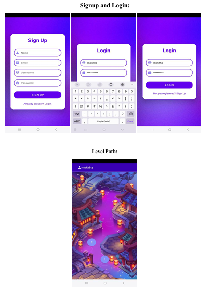
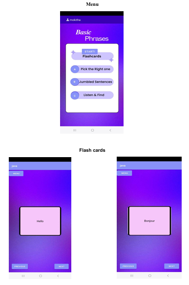
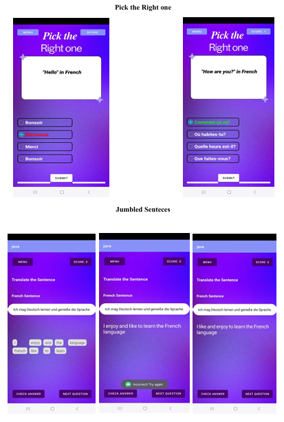
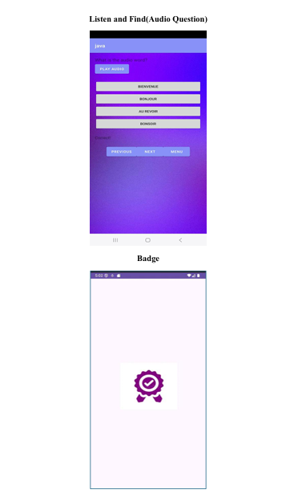

# Language Learning Tool

This project, LinguaSphere, is an interactive language learning tool designed to facilitate vocabulary building, grammar comprehension, and conversational skills in a structured, engaging way. The application includes multiple methods of learning and user-friendly features to adapt to the skill level of each learner.

---

## TABLE OF CONTENTS

1. [Aim](#aim)
2. [Features Offered](#features-offered)
3. [Libraries Used](#libraries-used)
4. [Integration/Execution Sequence](#integrationexecution-sequence)
5. [Compilers Used](#compilers-used)
6. [Files Used](#files-used)
7. [OOPS Concepts](#oops-concepts)
8. [Demo](#demo)

---

## AIM

The Language Learning Tool developed by the team aims to offer an accessible, adaptive, and enjoyable way for users to acquire a new language. This project uses a level-based structure to encourage learners to progress at their own pace, with varied methods designed to reinforce vocabulary, comprehension, grammar, and conversational skills.

---

## FEATURES OFFERED

- **User Authentication**: Sign-Up and Log-In with user details and password.
- **Interactive Learning Modules**:
  - *Flashcards*: For vocabulary building with translation support.
  - *Multiple Choice Questions (MCQ)*: For grammar and vocabulary assessment.
  - *Jumbled Sentences*: For practicing sentence structure.
  - *Text-to-Speech*: Audio support for pronunciation and listening skills.
- **Level-Based Progression**: Adapts to the user’s skill level.
- **User Progress Tracking**: Tracks completed lessons, scores, and skill level.
- **Firebase Integration**: For dynamic content retrieval and data storage.

---

## LIBRARIES USED

### Standard Libraries

- `java.util.ArrayList`: To store and manage flashcards and questions.
- `java.util.HashMap`: For storing user details and quiz data.
- `java.text`: For formatting dates and scores.
- `android.widget.*`: For implementing interactive Android UI components.
- `android.content.Intent`: For activity navigation within the app.

### User-Defined Libraries

- `FlashcardActivity`: Manages flashcard learning module.
- `JumbledWordsActivity`: Manages jumbled sentence module.
- `McqActivity`: Manages multiple-choice question activity.
- `TextToSpeechActivity`: Supports audio playback of vocabulary words.
- `LoginActivity` and `SignupActivity`: Manages user authentication.
- `UserService`: Handles user data and Firebase integration.

---

## INTEGRATION/EXECUTION SEQUENCE

The main sequence of operations in the Language Learning Tool application is as follows:

1. **User Authentication**: Users start with the Sign-Up/Log-In process, managed by `LoginActivity` and `SignupActivity`.
2. **Main Menu**: Once authenticated, users access the main menu where they can select from different learning modules.
3. **Learning Modules**:
   - **Flashcard Module**: Displays flashcards for vocabulary with translation. Users navigate through cards and can flip for answers.
   - **MCQ Module**: Presents questions with multiple-choice answers to assess vocabulary and grammar knowledge.
   - **Jumbled Sentences Module**: Users rearrange jumbled words to form grammatically correct sentences.
   - **Text-to-Speech Module**: Provides audio output for vocabulary words to aid pronunciation.
4. **Progress Tracking**: Upon completing an activity, progress is saved to Firebase, and scores are updated.
5. **Exit**: Users can log out or exit the app, with data saved to Firebase for future sessions.

---

## COMPILERS USED

- **Android Studio**: For developing and compiling the Android application.
- **Java Compiler**: For compiling Java classes within Android Studio.

---

## FILES USED

- `FlashcardActivity.java`: Manages flashcard display and navigation.
- `JumbledWordsActivity.java`: Implements jumbled word sentence formation.
- `McqActivity.java`: Manages MCQ quiz functionality.
- `TextToSpeechActivity.java`: Manages text-to-speech feature for pronunciation.
- `LoginActivity.java`: Manages user login operations.
- `SignupActivity.java`: Handles new user registration and Firebase integration.
- `UserService.java`: Manages user data interactions with Firebase.

---

## OOPS CONCEPTS

This project applies the following core Object-Oriented Programming (OOP) concepts:

- **Encapsulation**: Each module (such as FlashcardActivity, JumbledWordsActivity, etc.) encapsulates its data and behavior, making the application modular and maintainable. For example, the `UserService` class encapsulates user-related functionality and Firebase integration details, ensuring data security and ease of maintenance.
  
- **Abstraction**: The project uses abstraction to hide complex implementation details. For instance, `FlashcardActivity` abstracts the logic for navigating flashcards, while `McqActivity` abstracts the functionality of presenting and evaluating quiz questions, making these features easy to use without needing to understand the underlying code.

- **Inheritance**: Classes such as `FlashcardActivity`, `McqActivity`, and `JumbledWordsActivity` inherit from `AppCompatActivity`, allowing them to reuse Android’s activity lifecycle management and common UI features. This enables a cohesive and organized code structure while reducing redundancy.

- **Polymorphism**: Polymorphism is applied in the use of interfaces and overridden methods. For example, the `TextToSpeech.OnInitListener` interface allows `TextToSpeechActivity` to respond to initialization events with specific behavior. Additionally, methods like `onClick()` are overridden in different activities to provide customized functionality based on the module’s requirements.

---

## DEMO

  
  

  
  

This is a demo video of the application. Since the file size is large, download the raw video to view it.  

---
